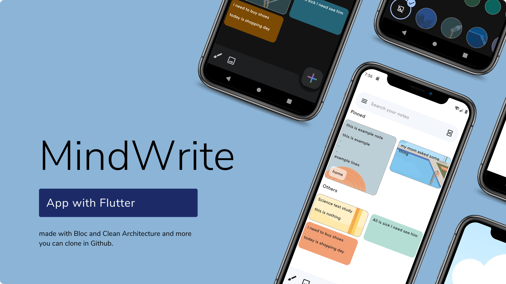

<div align="center">
  

  # MindWrite

  
  
</div>

---

**MindWrite** is a best-practice app built using **Clean Architecture** and **Bloc Pattern**, featuring modern technologies such as:

- `equatable`
- `image_picker`
- `get_it`
- `go_router`
- `hive`

and more!

---

## App Demo

<div align="center">
  
</div>

---

## Dependencies

```yaml
bloc: ^8.1.4
hive: ^2.2.3
uuid: ^4.5.0
intl: ^0.19.0
get_it: ^7.7.0
equatable: ^2.0.5
go_router: ^14.2.7
share_plus: ^10.0.2
hive_flutter: ^1.1.0
flutter_bloc: ^8.1.6
image_picker: ^1.1.2
flutter_svg: ^2.0.10+1
cupertino_icons: ^1.0.6
flutter_animate: ^4.5.0
loading_animation_widget: ^1.2.1
flutter_staggered_grid_view: ^0.7.0
syncfusion_flutter_signaturepad: ^26.2.14
```

---

## Features

- [x] Drawing capabilities
- [x] Archiving notes
- [x] Deleted notes management
- [x] Color palette and background images for notes
- [x] Add or take images for notes
- [x] Pinning and reordering lists
- [x] Label creation
- [x] Sharing, copying, and sending notes
- [x] Light theme support
- [x] Settings page for customization

---

## Upcoming Features (Todo)

- [ ] Text-to-speech functionality
- [ ] Reminders for notes
- [ ] Date picker for scheduling
- [ ] Persian language support
- [ ] Voice recording for notes
- [ ] Checkboxes in notes
- [ ] Undo and redo actions
- [ ] Note loading and drag-and-drop functionality
- [ ] Back button pop behavior
- [ ] Refactor to use model entity instead of noemodel

---
